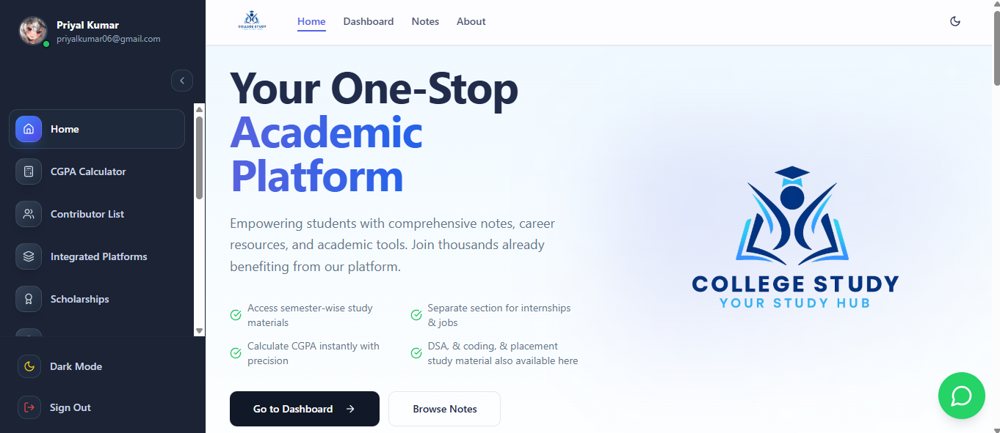
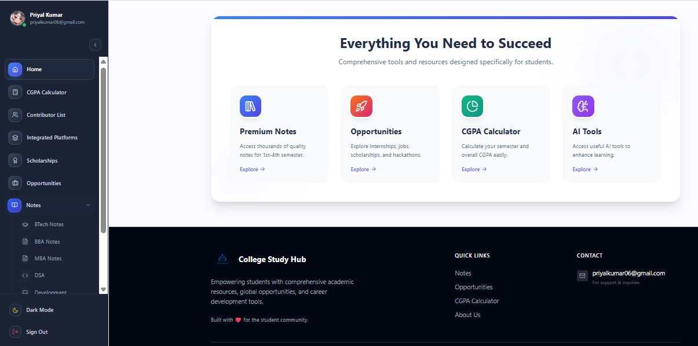
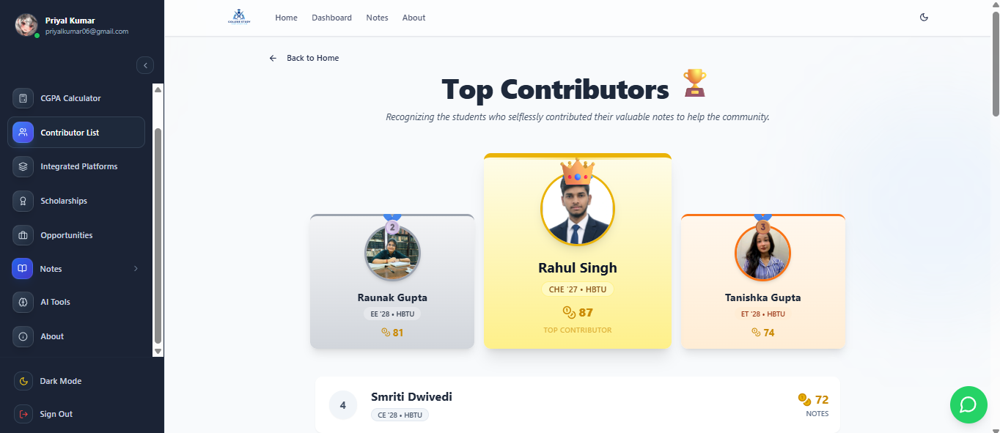
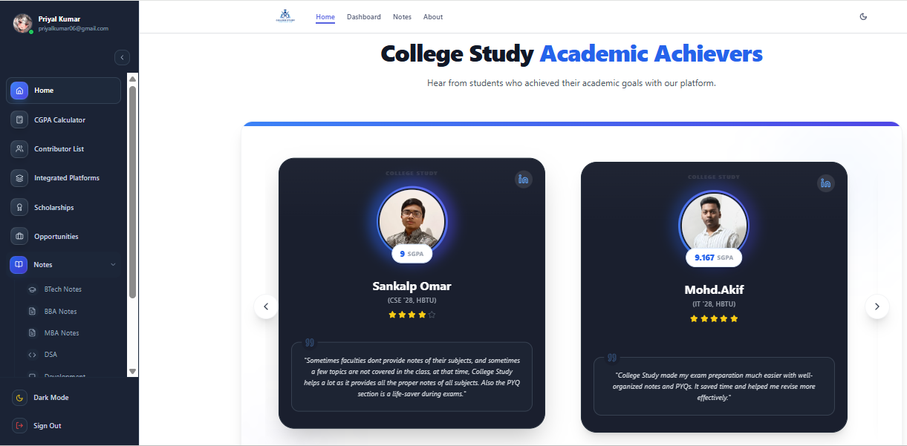
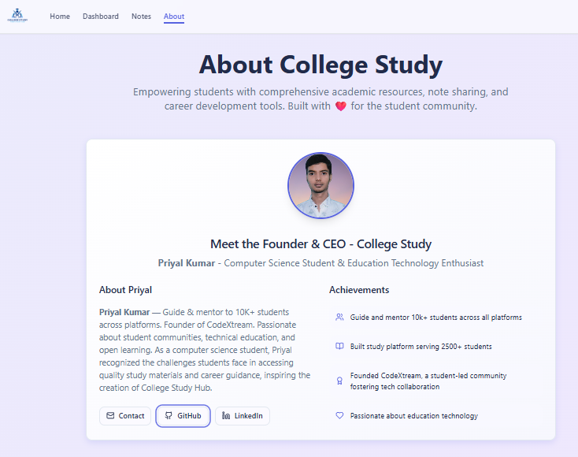

# College Study — Your Study Hub 🗂️📝

<div align="center">
  
  
  <br />
  
  ## 🌐 [Live Website : College Study](https://college-study.netlify.app/)
  <p><strong>A Premium Academic Platform for HBTU Kanpur Students</strong></p>

  <br/>

  [](https://college-study.netlify.app/)
  [](https://opensource.org/licenses/MIT)
  [](https://reactjs.org/)
  [](https://vitejs.dev/)
  [](https://www.typescriptlang.org/)
  [](https://tailwindcss.com/)
  [](https://supabase.com/)

</div>

---

## 🚀 Overview

**College Study** is a next-generation, full-stack academic platform built specifically for students of **HBTU Kanpur**. It serves as a unified hub for study materials, CGPA calculation, career roadmaps, scholarship listings, placement resources, GATE preparation, and a premium HR contacts/company directory.

Built as a **Progressive Web App (PWA)**, it is installable on mobile and desktop, works across all devices, and is backed by a robust **Supabase** backend with **Row Level Security**, **Role-Based Access Control**, and **Razorpay** payment integration.

---

## ✨ Key Features

### 📚 Academic Resources
- **Extensive Notes Repository** — Curated notes for B.Tech (11 branches, 8 semesters), BS-MS, BBA, MBA
- **DSA Notes** — Dedicated Data Structures & Algorithms study material
- **Web Development Notes** — Modern web dev resources
- **Coding Study Material** — Competitive programming content
- **Community Notes** — Student-submitted notes with admin approval workflow

### 🏆 Gamification & Community
- **Contributor Hall of Fame** — Gamified leaderboard with StudyCoins & Gold/Silver/Bronze badges
- **Student Success Stories** — Showcasing achievers
- **Animated Counters** — Live platform stats

### 📊 Academic Tools
- **CGPA Calculator** — Full-featured SGPA & CGPA computation with HBTU grading scale
- **ATS-Friendly Resume Builder** — Resume templates optimised for Applicant Tracking Systems

### 💼 Career & Placement
- **Opportunities Portal** — Jobs, Internships, Hackathons, Competitions
- **Placement Preparation** — Structured prep resources
- **Career Roadmaps** — Fresher job guide with step-by-step plans (premium)
- **Scholarships Portal** — Scholarship listings with deadline tracking & shareable deep-links
- **Useful AI Tools** — Curated AI tools for student productivity

### 🎓 GATE Preparation
- **GATE Study Hub** — Subject-wise GATE prep material (premium)
- **Interactive Quiz** — Branch and year-wise GATE practice questions

### 💎 Premium System
- **Company Directory** — Premium list of hiring companies
- **HR Emails Directory** — Direct HR contact database
- **Razorpay Integration** — Secure Indian payment gateway
- **Coupon System** — Discount codes (`HBTU@1843` = 100% off for HBTU students)

### 🔐 Authentication & Security
- **Email OTP Login** — Passwordless via Resend API (Supabase Edge Function)
- **Google OAuth** — One-click social login
- **hCaptcha** — Bot protection on registration
- **3-Tier RBAC** — Member / Admin / Owner roles with Postgres RLS

### 🛡️ Admin & Owner Tools
- **Admin Portal** — Approve notes, manage opportunities & scholarships
- **Owner Dashboard** — Full analytics (Recharts), user management, contributor CRUD
- **Mass Email Campaigns** — Personalised bulk emails to all registered students
- **Notification System** — In-app push notifications with unread badge
- **Coupon Management** — Create/deactivate discount codes
- **Login Activity Logs** — Secure admin-only user activity tracking

### 🎨 UI/UX
- **Dark / Light Mode** — `next-themes` togglable themes
- **Framer Motion Animations** — Smooth page transitions and micro-interactions
- **PWA** — Installable on Android/iOS/desktop
- **Mobile-First Design** — Fully responsive across all screen sizes
- **Custom Sidebar** — Collapsible app navigation
- **WhatsApp Float Button** — Quick contact CTA
- **Cookie Consent** — GDPR-compliant consent banner

---

## 🛠️ Tech Stack

<div align="center">

[](https://reactjs.org/)
[](https://www.typescriptlang.org/)
[](https://vitejs.dev/)
[](https://tailwindcss.com/)
[](https://ui.shadcn.com/)
[](https://www.framer.com/motion/)
[](https://supabase.com/)
[](https://reactrouter.com/)
[](https://tanstack.com/query)
[](https://razorpay.com/)
[](https://recharts.org/)
[](https://zod.dev/)
[](https://web.dev/progressive-web-apps/)

</div>

| Layer | Technology | Purpose |
|---|---|---|
| Frontend Framework | React 18 + TypeScript | Component-based UI |
| Build Tool | Vite 5 + SWC Plugin | Fast HMR & bundling |
| Routing | React Router DOM v6 | 101-page SPA routing |
| Server State | TanStack React Query v5 | Data fetching & caching |
| Styling | Tailwind CSS v3 | Utility-first CSS |
| UI Components | Shadcn/UI + Radix UI | Accessible headless components |
| Animations | Framer Motion v12 | Page transitions & micro-interactions |
| Forms | React Hook Form + Zod | Validation & form state |
| Charts | Recharts v2 | Admin analytics |
| Backend | Supabase (PostgreSQL) | Database, Auth, Storage |
| Edge Functions | Deno (TypeScript) | OTP Email + Mass Email |
| Email | Resend API | Transactional + campaign emails |
| Payments | Razorpay | Indian payment gateway |
| Hosting | Netlify | CDN + CI/CD |
| PWA | vite-plugin-pwa | Installable web app |
| Bot Protection | hCaptcha | Registration protection |

---

## 🏛️ System Architecture

```
┌──────────────────────────────────────────┐
│           React SPA (Netlify CDN)        │
│   React 18 · TypeScript · Vite · PWA    │
│   Tailwind · Shadcn/UI · Framer Motion  │
└──────────┬───────────────────────────────┘
           │ HTTPS (REST + Realtime)
┌──────────▼───────────────────────────────┐
│              Supabase Platform           │
│  ┌──────────┐  ┌──────────┐  ┌────────┐ │
│  │   Auth   │  │PostgreSQL│  │Storage │ │
│  │JWT·OAuth │  │15+Tables │  │  PDFs  │ │
│  │  hCaptcha│  │RLS on all│  │ Images │ │
│  └──────────┘  └──────────┘  └────────┘ │
│  ┌──────────────────────────────────┐    │
│  │     Edge Functions (Deno)        │    │
│  │  send-otp-email │ send-campaign  │    │
│  └──────────────────────────────────┘    │
└──────────┬───────────────────────────────┘
           │
┌──────────▼───────────────────────────────┐
│          Third-Party Services            │
│  Resend API · Razorpay · Google OAuth   │
└──────────────────────────────────────────┘
```

---

## 🗄️ Database Overview

| Table | Purpose |
|---|---|
| `profiles` | User profile info (branch, batch, coins, avatar) |
| `admin_roles` | Role assignments (member/admin/owner) |
| `premium_purchases` | Payment records (Razorpay + coupon) |
| `notifications` | In-app broadcast notifications |
| `user_notification_reads` | Tracks which notifications each user has seen |
| `opportunities` | Jobs, Internships, Hackathons listings |
| `scholarships` | Scholarship listings |
| `contributors` | Notes contributor leaderboard |
| `company_directory` | Premium company listings |
| `coupon_codes` | Discount codes for premium plans |
| `email_templates` | Rich email templates (logo, banner, CTAs) |
| `email_campaigns` | Mass email campaign records |
| `email_logs` | Per-recipient email delivery logs |
| `signup_attempts` | Registration tracking (pending/verified/failed) |
| `study_materials` | Community-submitted notes (approval workflow) |

---

## 📸 Gallery

<div align="center">
  <table>
    <tr>
      <td align="center">
        
        <br />
        <em>Home Page, College Study</em>
      </td>
      <td align="center">
        
        <br />
        <em>All You need to succeed</em>
      </td>
    </tr>
    <tr>
    <tr>
      <td align="center">
        
        <br />
        <em>User Profile & Stats</em>
      </td>
      <td align="center">
        
        <br />
        <em>Our Top Notes Contributors </em>
      </td>
    </tr>
      <td align="center">
        
        <br />
        <em>Academic Achievers</em>
      </td>
      <td align="center">
        
        <br />
        <em>About the Platform</em>
      </td>
    </tr>
  </table>
</div>

---

## 🚀 Getting Started

### Prerequisites

- Node.js (v18 or higher)
- npm or yarn

### Installation

1.  **Clone the repository**:
    ```bash
    git clone https://github.com/PriyalKumar01/studyhub-unlocked-nexus.git
    cd studyhub-unlocked-nexus
    ```

2.  **Install dependencies**:
    ```bash
    npm install
    ```

3.  **Environment Setup**:
    Create a `.env` file in the root directory:
    ```env
    VITE_SUPABASE_URL=your_supabase_url
    VITE_SUPABASE_ANON_KEY=your_supabase_anon_key
    ```

4.  **Run Development Server**:
    ```bash
    npm run dev
    ```
    The application will be available at `http://localhost:8080`.

5.  **Build for Production**:
    ```bash
    npm run build
    ```

---

## 🔐 Security Highlights

- ✅ **Row Level Security (RLS)** on every PostgreSQL table
- ✅ **JWT Authentication** — Supabase RS256 signed tokens
- ✅ **hCaptcha** bot protection on sign-up
- ✅ **3-Tier RBAC** — member / admin / owner with granular permissions
- ✅ **SECURITY DEFINER** DB functions for admin-only operations
- ✅ **HTTPS** enforced on all endpoints (Netlify + Supabase)
- ✅ **GDPR** Cookie Consent banner
- ✅ **Deep-link sharing** with public slug-based URLs (no auth leak)

---

## 📜 License

This project is licensed under the **MIT License**.
See the [LICENSE](LICENSE) file for details.

> **Note**: This repository contains proprietary educational content and student data. Unauthorized distribution or commercial use of the notes and personal data is strictly prohibited.

---

## 👨‍💻 Founder

<div align="center">
  <h3>Priyal Kumar</h3>
  <p>Visionary • Full-Stack Developer • Student Leader</p>
  
  <a href="https://github.com/PriyalKumar01">
    
  </a>
  <a href="https://linkedin.com/in/priyal-kumar-374282324">
    
  </a>
</div>

---

<div align="center">
  <p><em>© 2026 College Study Web. All rights reserved.</em></p>
  <p>Built with ❤️ for the student community of HBTU Kanpur.</p>
</div>
